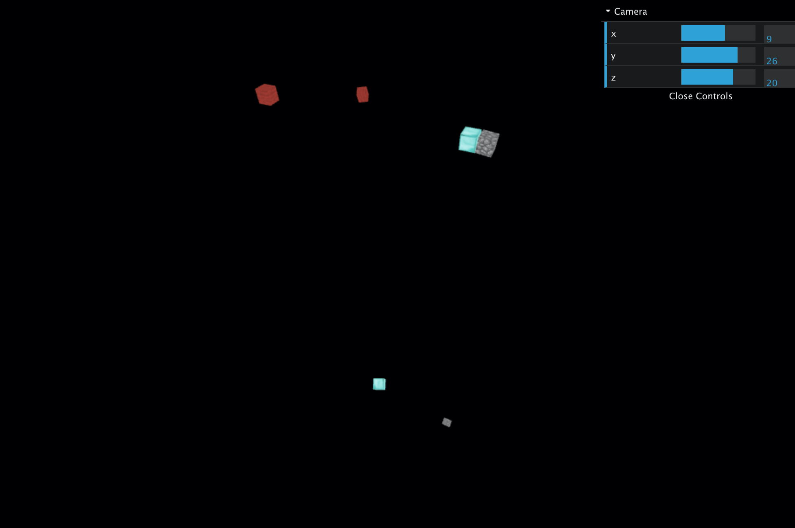

# Vue THREE.js Hello World

A [`THREE.js`](https://github.com/mrdoob/three.js) “Hello World” repository for [Vue.js](https://vuejs.org/) that uses single-file components. Uses [`vue-threejs`](https://github.com/fritx/vue-threejs/).



## Demo

https://mgiraldo.github.io/vue-threejs-hello-world/

## Project setup
```
yarn install
```

### Compiles and hot-reloads for development
```
yarn serve
```

### Compiles and minifies for production
```
yarn build
```

### Lints and fixes files
```
yarn lint
```
